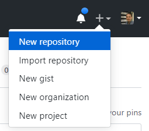

# UF Research Computing git and gitbub.com training

This training will start with some slides which are in the gh-pages branch and online at <https://ufresearchcomputing.github.io/git-training/#/>

After going over the slides, we'll come back to this.

## Resources

There are many great git and github.com tutorials out there. Here are some that I particularly like and have relied on in developing this training.

Source | Notes
-------|------
[Software Carpentry Version Control with Git](http://swcarpentry.github.io/git-novice/) | This is a popular module in the Software Carpentry curriculum. It is designed to be a 3-hour instructor-lead training module but can be worked through on your own as well.
[GitHub Learning Lab](https://lab.github.com/) | This site has many lessons that use github.com and automation to walk users through hands-on exercises to learn aspects of git and github.com using the tools.
[try.github.io](https://try.github.io/) | More github tutorials
[education.github.com](https://education.github.com/)| Information on educational discounts--plans change regularly, check for current benefits.
[classroom.github.com](https://classroom.github.com/)| For instructors wanting to use git in the classroom. Manages individual and group assignments, great tool for the classroom! Also, stickers!
[pages.github.com](https://pages.github.com/)| Information on using github.com to host web sites.
[bitbucket.org](https://bitbucket.org/product)| Github is not the only host of git repositories. Bitbucket is another popular host.
[gitlab.com](https://about.gitlab.com/)| Another git hosting option

## Setup

The [git_setup.md](git_setup.md) page has some basic git and github configuration information.

## Hands-on exercise

This exercise is adapted from the Software Carpentry [Version Control with Git](http://swcarpentry.github.io/git-novice/) training.

This exercise tells the tail of Wolfman and Dracula who are investigating if it is possible to send a planetary lander to Mars.

[Werewolf vs dracula](https://www.deviantart.com/b-maze/art/Werewolf-vs-Dracula-124893530)
by [b-maze](https://www.deviantart.com/b-maze) / [Deviant Art](https://www.deviantart.com/).
[Mars](https://en.wikipedia.org/wiki/File:OSIRIS_Mars_true_color.jpg) by European Space Agency /
[CC-BY-SA 3.0 IGO](https://creativecommons.org/licenses/by/3.0/deed.en).
[Pluto](https://commons.wikimedia.org/wiki/File:PIA19873-Pluto-NewHorizons-FlyingPastImage-20150714-transparent.png) /
Courtesy NASA/JPL-Caltech.
[Mummy](https://commons.wikimedia.org/wiki/File:Mummy_icon_-_Noun_Project_4070.svg)
&copy; Gilad Fried / [The Noun Project](https://thenounproject.com/) /
[CC BY 3.0](https://creativecommons.org/licenses/by/3.0/deed.en).
[Moon](https://commons.wikimedia.org/wiki/File:Lune_ico.png)
&copy; Luc Viatour / [https://lucnix.be](https://lucnix.be/) /
[CC BY-SA 3.0](https://creativecommons.org/licenses/by-sa/3.0/deed.en).

### Creating a Repository

While we can start creating the repository from scratch, I typically find it easier to create the repo online, clone it to the local computer (or cluster), add the content and `push` the changes.

To create a new repo, on github.com, click the +-icon in the top right and select New repository:

Let's call this repo "planets" and leave the rest of the settings with the defaults and click "Create repository":

Note that I have my account setup for using SSH keys, so I clicked the "SSH" button circled in red below. If you have not setup SSK keys and two-factor authentication, you can leave the HTTPS button clicked.

> To learn about setting up your github account to use ssh keys, check out [this github page](https://docs.github.com/en/free-pro-team@latest/github/authenticating-to-github/connecting-to-github-with-ssh) and a [short video with a walk-through](https://web.microsoftstream.com/video/b0e02a2d-f108-44ff-aea2-276d98a8b524).

At this point, we have a repository, but there isn't anything in it. GitHub provides a number of options about what we can do from here. For this tutorial, I will use the "…or create a new repository on the command line" instructions.

I will do this in my account on HiPerGator, but you could do it on your computer (use the Terminal on Mac or Git Bash on Windows).

1. Log into HiPerGator: `ssh gatorlink@hpg.rc.ufl.edu` (Replacing `gatorlink` with *your* GatorLink)
1. Make a directory for this repository: `mkdir planets`
   * It is best if the directory name matches the repository name
1. Change directories into this new folder: `cd planets`
1. Copy the commands in the "…or create a new repository on the command line" box on the github.com page and then paste them into your terminal--**Make sure you are in the `planets` directory**:
   * These commands do a number of things:
      * `echo "# planets" >> README.md` Creates the starts of the README.md document for the repo.
      * `git init` Tells git that this is a git repository and creates all the infrastructure to treat it as such.
      * `git add README.md` Places the README.md file in the staging area and tells git to track changes to this file.
      * `git commit -m "first commit"` Commits the changes to the local repo. This records the changes and sets a point in history that can be recovered.
      * `git branch -M main` Makes sure that the main branch is called `main`. The default in some accounts is still the racially insensitive term 'master'.
      * `git remote add origin git@github.com:*magitz*/planets.git` This connects the local repo to the one on GitHub that we made to start with. **Note:** My github username is *magitz*, you will need to use your github.com username. But that should be set when you copy/paste.
      * `git push -u origin main` This `push`es our changes to GitHub.
         * If you have not setup SSH keys, you will be asked for your github.com username and password.

## Continue on the [Hands-on page 2](Hands-on2.md)
